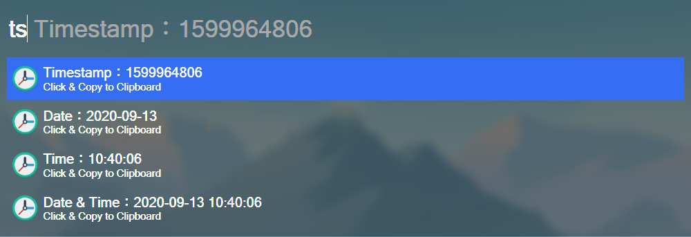
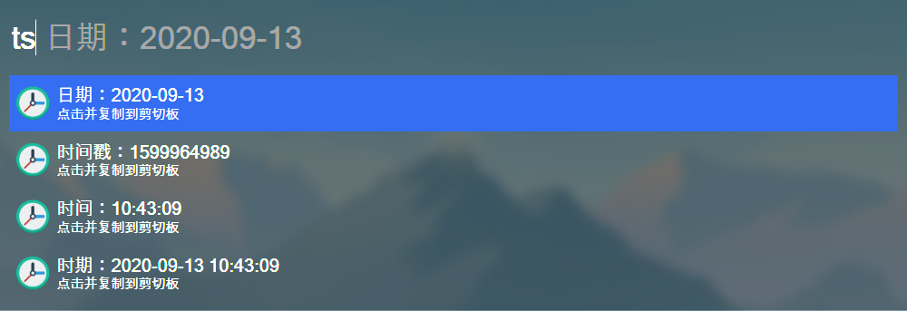

# Flow.Launcher.Plugin.Timestamp

A time plugin for Flow.

 

## :bookmark: Versions

- `Flow` master branch
- `Wox` wox branch

## :sparkles: Features

- :globe_with_meridians: Global Language.
    

## :wrench: Configs

You can edit config in [.env](.env).

- `Language` 
- `Split Symbol`
    - `Time`
    - `Date`

## :pushpin: Requirements

- Python3.6(+)
- `pyperclip`
- `python-dotenv`

More requirements, please see [requirements.txt](requirements.txt).
